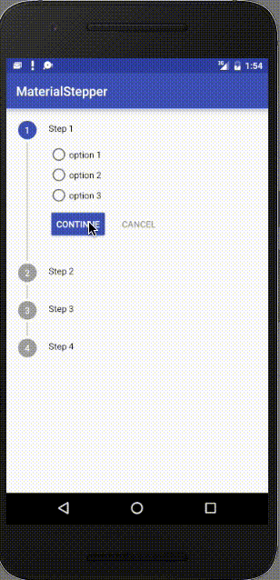

# MaterialStepper
Android library for Steppers inside Material guidelines

# How to use

Extend your class from StepView. You can do any logic you want in here and add any view you like for your steps. 

@Override
public int customStepResource() {
    //Should return the layout resource id you want for this step.
}

@Override
public boolean onStepSuccess() {
    // should return after your validations if the step is successful or not
}

@Override
public String showTitle() {
    // title for this step.
}

@Override
public void onStepCancel() {
    // you can handle special cases when canceling.
}

@Override
public String showSelection() {
    // update the subtitle label with the value the user selected. Just return an string with your data.
}

Add this to your activity or fragment:

    <pedrocarrillo.com.materialstepperlibrary.StepLayout
        android:id="@+id/stepLayout"
        android:layout_width="wrap_content"
        android:layout_height="wrap_content"/>

Once you have this you can do the following:

stepLayout = (StepLayout) findViewById(R.id.stepLayout);
Step1Test step1 = new Step1Test(this);

Step1Test step2 = new Step1Test(this);
Step1Test step3 = new Step1Test(this);
Step1Test step4 = new Step1Test(this);

stepLayout.addStepView(step1);
stepLayout.addStepView(step2);
stepLayout.addStepView(step3);
stepLayout.addStepView(step4);

stepLayout.setStepLayoutResult(new StepLayoutResult() {
    @Override
    public void onFinish() {
        Toast.makeText(MainActivity.this, "YOU FINISHED", Toast.LENGTH_SHORT).show();
    }

    @Override
    public void onCancel() {

        Toast.makeText(MainActivity.this, "you want to go back?", Toast.LENGTH_SHORT).show();
    }
});

stepLayout.load();

# License

The MIT License (MIT)

Copyright (c) 2015 Pedro Pablo Carrillo Chero

Permission is hereby granted, free of charge, to any person obtaining a copy of this software and associated documentation files (the "Software"), to deal in the Software without restriction, including without limitation the rights to use, copy, modify, merge, publish, distribute, sublicense, and/or sell copies of the Software, and to permit persons to whom the Software is furnished to do so, subject to the following conditions:

The above copyright notice and this permission notice shall be included in all copies or substantial portions of the Software.

THE SOFTWARE IS PROVIDED "AS IS", WITHOUT WARRANTY OF ANY KIND, EXPRESS OR IMPLIED, INCLUDING BUT NOT LIMITED TO THE WARRANTIES OF MERCHANTABILITY, FITNESS FOR A PARTICULAR PURPOSE AND NONINFRINGEMENT. IN NO EVENT SHALL THE AUTHORS OR COPYRIGHT HOLDERS BE LIABLE FOR ANY CLAIM, DAMAGES OR OTHER LIABILITY, WHETHER IN AN ACTION OF CONTRACT, TORT OR OTHERWISE, ARISING FROM, OUT OF OR IN CONNECTION WITH THE SOFTWARE OR THE USE OR OTHER DEALINGS IN THE SOFTWARE.